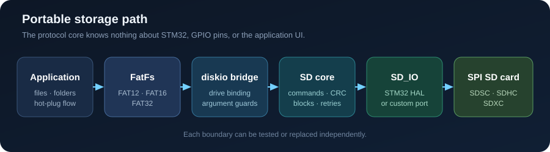

<p align="center"><strong>中文</strong> · <a href="README.md">English</a></p>

<h1 align="center">STM32 HAL SPI SD + FatFs</h1>

<p align="center">
  可移植的 SPI 模式 SD 卡驱动、FatFs 接入层，以及可以直接刷写的 STM32F103 示例。
</p>

<p align="center">
  <a href="https://github.com/akasa828/STM32_HAL-SPI_SD-FatFs/releases/latest"></a>
  <a href="https://github.com/akasa828/STM32_HAL-SPI_SD-FatFs/actions/workflows/ci.yml"></a>
  
  
  <a href="LICENSE"></a>
</p>

<p align="center">
  <a href="#运行完整示例">运行示例</a> ·
  <a href="#移植到自己的工程">移植驱动</a> ·
  <a href="docs/API_ZH.md">API</a> ·
  <a href="docs/PORTING_ZH.md">移植说明</a> ·
  <a href="https://github.com/akasa828/STM32_HAL-SPI_SD-FatFs/issues">问题反馈</a>
</p>

<p align="center">
  
</p>

如果你需要在 SPI SD 卡上使用 FatFs，但又不想让协议代码绑定某一个
SPI 外设、CS 引脚，甚至绑定 STM32 HAL，那么可以只取走这个仓库里的驱动部分。
同一套核心也实际用于
[SD Card OVID Player](https://github.com/akasa828/SD_Card_OVID_Player)，负责文件浏览、
容量扫描和拔卡恢复。

## 为什么单独整理这个仓库

不少 SD 示例在第一次成功挂载后就结束了。这个项目把各层分开，也保留了应用真正运行
一段时间后才会遇到的部分：

| | 这里提供的内容 |
|---|---|
| 可移植核心 | `SD_IO` 回调都带有用户上下文；协议核心不包含 HAL 类型，也不写死 SPI、GPIO 或 UI。 |
| 完整存储链路 | SDSC/SDHC/SDXC 初始化、块读写、CRC16、FatFs `diskio` 以及 FAT12/FAT16/FAT32 示例。 |
| 可恢复流程 | 明确的反初始化、在线检测、事务保护和重新挂载规则。 |
| 可直接运行 | STM32F103C8T6 工程、CubeMX 文件、CMake Presets、ST-Link 调试配置和 VS Code `F5` 流程。 |
| 不接板也能测试 | 脚本化 SPI 响应覆盖命令帧、寻址、重试、CRC、超时和 HAL 配置检查。 |

## 支持的操作

- SDSC v1/v2、SDHC/SDXC 的 SPI 模式初始化。
- 单块/多块读写、擦除、状态、CID、CSD 和 SCR。
- 数据 CRC16、有限次数重试和低速握手/高速传输切换。
- 通过独立 `SD_Card` 与 `SD_IO` 上下文支持多个卡实例。
- 通过 `SD_FatFs_Attach()` 接入 FatFs R0.15。
- 可选的“完成时恢复原数据”原始扇区自检。

## 运行完整示例

1. 下载或克隆仓库，用 VS Code 打开**项目根目录**。
2. 安装推荐的 ST 官方 STM32 扩展，并允许 Bundle Manager 安装工具。
3. 连接模块、插入 FAT 格式 SD 卡，再连接 ST-Link。
4. 选择 `Debug` 或 `Release` 后按 `F5`，选择
   `SD/FatFs demo: Build, flash and debug`。

| Micro SD 模块 | STM32F103C8T6 |
|---|---|
| VCC | 3.3 V |
| GND | GND |
| SCK | PA5 / SPI1 SCK |
| MISO | PA6 / SPI1 MISO |
| MOSI | PA7 / SPI1 MOSI |
| CS | PB0 |
| 可选日志 TX | PA9 / USART1 TX，115200-8-N-1 |

示例会等待插卡、挂载卷、打印根目录、写入并读回 `/FS_TEST.TXT`，随后检测拔卡并等待重新挂载。

> [!WARNING]
> 示例会创建或覆盖 `/FS_TEST.TXT`，但不会格式化 SD 卡，也不会默认执行原始扇区自检。

> [!CAUTION]
> 原始扇区自检只有在执行到恢复步骤时才会还原原数据。测试写入后若发生断电或复位，
> 仍可能损坏数据。请只使用可丢弃的卡或确认未使用的扇区。

## 移植到自己的工程

最小的平台无关驱动只需要：

```text
Core/Micro_SD/SD_reader.c
Core/Micro_SD/SD_reader.h
```

STM32 HAL 工程再加入 `Core/Port/sd_stm32_hal.c/.h`；需要 FatFs 时加入
`Core/fatfs/`。挂载前先绑定硬件和文件系统：

```c
SD_STM32_HAL adapter = {
    .spi = &hspi1,
    .cs_port = GPIOB,
    .cs_pin = GPIO_PIN_0,
    .low_prescaler = SPI_BAUDRATEPRESCALER_256,
    .high_prescaler = SPI_BAUDRATEPRESCALER_16,
};

SD_STM32_HAL_Attach(&g_sd_card, &adapter);
SD_FatFs_Attach(&g_sd_card);
f_mount(&fs, "", 1);
```

换用其他 MCU 时，实现 `SD_IO` 中的回调并调用 `SD_Card_BindIO()` 即可。
[移植说明](docs/PORTING_ZH.md)列出了 SPI 约束；[API 文档](docs/API_ZH.md)说明生命周期、
返回值和并发规则。

出现 `FR_DISK_ERR`、`FR_NOT_READY` 或拔卡后，应先关闭文件对象并卸载，调用
`SD_DeInit_Card()`，必要时恢复外设，然后重新绑定和挂载。旧的 `FIL`、`DIR` 对象不能继续使用。

## 验证范围

每次 Push 和 Pull Request 都会检查：

| 检查 | 当前覆盖内容 |
|---|---|
| 主机回归测试 | 协议核心、命令 CRC、FatFs 参数保护、自检恢复、STM32 HAL 适配层 |
| 静态分析 | `cppcheck` warning、performance 和 portability 检查 |
| 固件构建 | GNU Arm 工具链下的 STM32F103 Debug/Release |

这些测试能让协议回归稳定复现；电气时序、模块电平转换、信号质量以及不同 SD 卡的具体表现，
仍需在目标硬件上验证。

## 项目结构

- `Core/Micro_SD/` — 平台无关的 SD SPI 协议核心。
- `Core/Port/` — STM32 HAL 适配层和可选兼容包装。
- `Core/fatfs/` — FatFs R0.15 与可绑定的 `diskio` 接入。
- `Core/Src/main.c` — 挂载、目录读取、写回和重新插卡示例。
- `tests/` — 可在电脑上运行的协议与适配层回归测试。
- `docs/` — [API](docs/API_ZH.md)和[移植说明](docs/PORTING_ZH.md)。

欢迎提交硬件测试结果或改进，具体见 [CONTRIBUTING.md](CONTRIBUTING.md)。如果它确实帮你
少踩了一些坑，点个 Star 就够了，也会让其他 STM32 开发者更容易找到这个驱动。

项目自有代码采用 [MIT License](LICENSE)。FatFs、STM32 HAL 与 CMSIS 保留各自许可证，
详见[第三方说明](THIRD_PARTY_LICENSES.md)。
